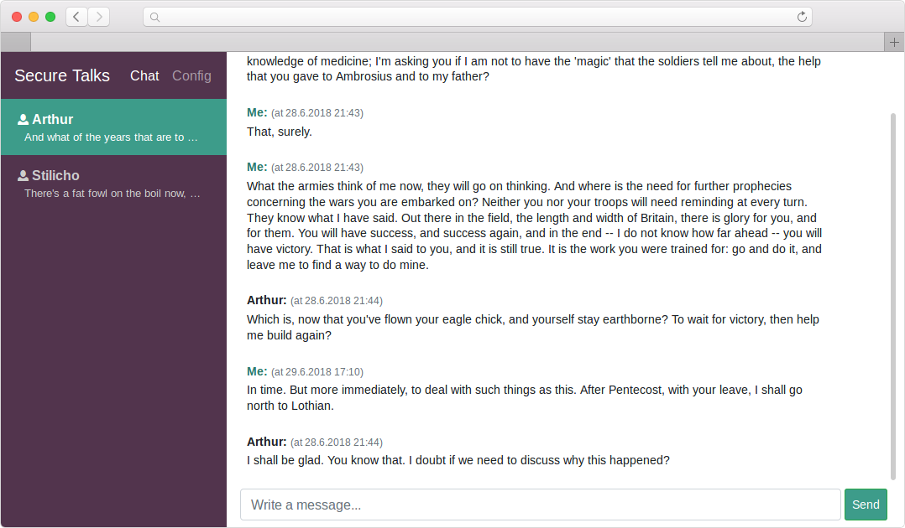

**Securetalks** - decentralized anonymous messaging platform.



## Features
It is based on the ideas behind BitMessage, but featuring RSA cryptography and modern user interface.

In Securetalks the sender and the receiver of the message are hidden from participants of the network. There is also no way to determine IP address of the particular network member.

**Caution:** This is pre-alpha software, use it at your own risks. Security audit needed.

## Installation And Usage
Installation is possible by cloning the repository:

```bash
git clone git@github.com:Zamony/securetalks.git securetalks-sources
```

Then you can launch it from `securetalks-sources` as:  (Python 3.7 or above)
```bash
python -m securetalks
```

## Configuration
In your home folder make a directory called ".securetalks" if it isn't present. 
There should be two configuration files `bootstrap.list` and `config.txt`. (Create them, If they aren't present)

The first file `bootstrap.list` contains addresses used to connect at the programs's startup. An example structure of the file:
```
1.2.3.4:8001
5.6.7.8:9002
```
The second file `config.txt` contains main configuration proprties. It's default structure is:
```
[Server]
address = 0.0.0.0
port = 8001

[GUI]
port = 8002
```

## Third-party
+ [cryptography](https://github.com/pyca/cryptography)
+ [webevents](https://github.com/Zamony/webevents)
+ [Kite Layout](https://github.com/Zamony/kite-layout)